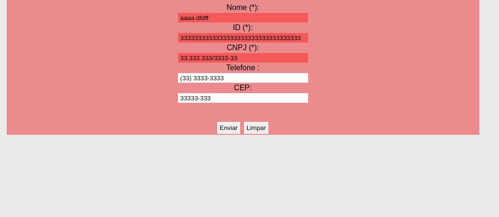
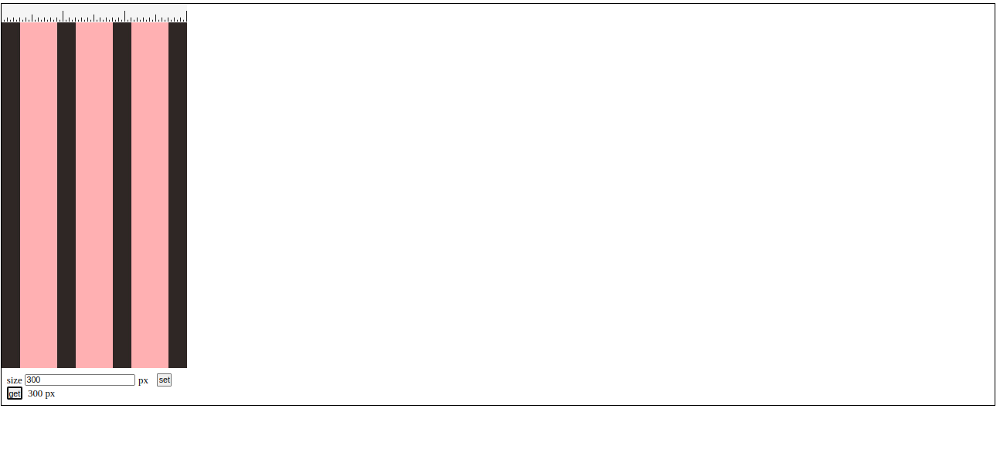
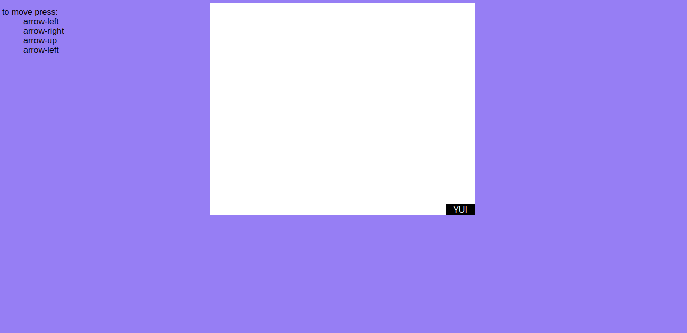

# YUI_html

## pequenas aplicações feitas com html5 usando YUI

----
## [mascara_validacao](./mascara_validacao/)

## [generate_grid](./generate_grid/)

## [event_key_yui](./event_key_yui/)

## Rodar
So abrir o html no navegador.